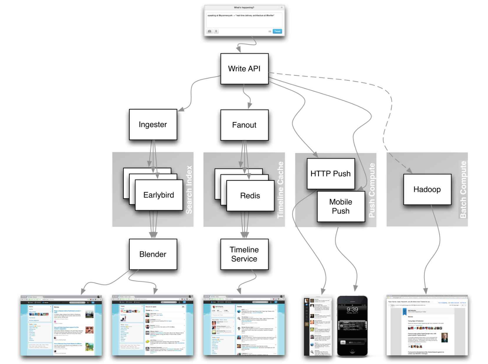

Real world large scale Product System design is a very broad topic. Even Enterprise Architects/ Veteran software engineer with many years of working experience at a top IT company may not be an expert on system design.


This offers a reference to ***Product Company Engineering blogs & Real World Architectures*** for to handle the system design with a systematic approach in a short time. I have been visiting these refences to garner my point of view. 
Please dive into each topic if you have time. Of course, welcome to add your thoughts!

## <a name='toc'>Table of Contents</a>
- [ ] [Company Engineering Blogs](#blog)
- [ ] [Real World Products and Systems Architecture References](#system)
- [ ] [Hot Pointers and Reference](#qs)
- [ ] [Lower Level Design FAQ](#Lower-Level-Design-FAQ)
- [ ] [Useful Website & Books](#intro)


### [[⬆]](#toc) <a name='blog'>Company Engineering Blogs:</a>

If you are going to have an onsite with a company, you should read their engineering blog. 

* [High Scalability](http://highscalability.com/)
* [The GitHub Blog](https://github.com/blog/category/engineering)
* [Engineering at Quora](http://engineering.quora.com/)
* [Yelp Engineering Blog](http://engineeringblog.yelp.com/)
* [Twitter Engineering](https://engineering.twitter.com/)
* [Facebook Engineering](https://www.facebook.com/Engineering)
* [Yammer Engineering](http://eng.yammer.com/blog/)
* [Etsy Code as Craft](http://codeascraft.com/)
* [Foursquare Engineering Blog](http://engineering.foursquare.com/)
* [Airbnb Engineering](http://nerds.airbnb.com/)
* [WebEngage Engineering Blog](http://engineering.webengage.com/)
* [LinkedIn Engineering](http://engineering.linkedin.com/blog)
* [The Netflix Tech Blog](http://techblog.netflix.com/)
* [BankSimple Simple Blog](https://www.simple.com/engineering/)
* [Square The Corner](http://corner.squareup.com/)
* [SoundCloud Backstage Blog](https://developers.soundcloud.com/blog/)
* [Flickr Code](http://code.flickr.net/)
* [Instagram Engineering](http://instagram-engineering.tumblr.com/)
* [Dropbox Tech Blog](https://tech.dropbox.com/)
* [Cloudera Developer Blog](http://blog.cloudera.com/)
* [Bandcamp Tech](http://bandcamptech.wordpress.com/)
* [Oyster Tech Blog](http://tech.oyster.com/)
* [THE REDDIT BLOG](http://www.redditblog.com/)
* [Groupon Engineering Blog](https://engineering.groupon.com/)
* [Songkick Technology Blog](http://devblog.songkick.com/)
* [Google Research Blog](http://googleresearch.blogspot.com/)
* [Pinterest Engineering Blog](http://engineering.pinterest.com/)
* [Twilio Engineering Blog](http://www.twilio.com/engineering)
* [Bitly Engineering Blog](http://word.bitly.com/)
* [Uber Engineering Blog ](https://eng.uber.com/)
* [Godaddy Engineering](http://engineering.godaddy.com/)
* [Splunk Blog](http://blogs.splunk.com/)
* [Coursera Engineering Blog](https://building.coursera.org/)
* [PayPal Engineering Blog](https://www.paypal-engineering.com/)
* [Nextdoor Engineering Blog](https://engblog.nextdoor.com/)
* [Booking.com Development Blog](https://blog.booking.com/)
* [Scalyr Engineering Blog ](https://blog.scalyr.com/)
* [Microsoft Engineering](https://engineering.microsoft.com/)
* [Microsoft Python Engineering](https://blogs.msdn.microsoft.com/pythonengineering/)
* [Paypal Developer Blog](https://medium.com/paypal-engineering)
* [Spotify Labs](https://labs.spotify.com/)
* [Twilio Engineering Blog](http://www.twilio.com/engineering)
* [Twitter Engineering](https://blog.twitter.com/engineering/)
* [Yahoo Engineering Blog](http://yahooeng.tumblr.com/)
* [Heroku Engineering Blog](https://engineering.heroku.com/)
* [High Scalability](http://highscalability.com/)
* [Instagram Engineering](http://instagram-engineering.tumblr.com/)
* [Intel Software Blog](https://software.intel.com/en-us/blogs/)

### [[⬆]](#toc) <a name='system'> Real World Products and Systems- Company Architecture References:</a>


| Company | Reference(s) |
|---|---|
|Uber Architecture | [Uber Architecture](http://highscalability.com/blog/2015/9/14/how-uber-scales-their-real-time-market-platform.html)|
| Netflix | [A 360 Degree View Of The Entire Netflix Stack](http://highscalability.com/blog/2015/11/9/a-360-degree-view-of-the-entire-netflix-stack.html)<br/>[Netflix: What Happens When You Press Play?](http://highscalability.com/blog/2017/12/11/netflix-what-happens-when-you-press-play.html) |
| Amazon | [Amazon architecture](http://highscalability.com/amazon-architecture) |
| Cinchcast | [Producing 1,500 hours of audio every day](http://highscalability.com/blog/2012/7/16/cinchcast-architecture-producing-1500-hours-of-audio-every-d.html) |
| DataSift | [Realtime datamining At 120,000 tweets per second](http://highscalability.com/blog/2011/11/29/datasift-architecture-realtime-datamining-at-120000-tweets-p.html) |
| DropBox | [How we've scaled Dropbox](https://www.youtube.com/watch?v=PE4gwstWhmc) |
| ESPN | [Operating At 100,000 duh nuh nuhs per second](http://highscalability.com/blog/2013/11/4/espns-architecture-at-scale-operating-at-100000-duh-nuh-nuhs.html) |
| Google | [Google architecture](http://highscalability.com/google-architecture) |
| Instagram | [14 million users, terabytes of photos](http://highscalability.com/blog/2011/12/6/instagram-architecture-14-million-users-terabytes-of-photos.html)<br/>[What powers Instagram](http://instagram-engineering.tumblr.com/post/13649370142/what-powers-instagram-hundreds-of-instances) |
| Justin.tv | [Justin.Tv's live video broadcasting architecture](http://highscalability.com/blog/2010/3/16/justintvs-live-video-broadcasting-architecture.html) |
| Facebook | [Scaling memcached at Facebook](https://cs.uwaterloo.ca/~brecht/courses/854-Emerging-2014/readings/key-value/fb-memcached-nsdi-2013.pdf)<br/>[TAO: Facebook’s distributed data store for the social graph](https://cs.uwaterloo.ca/~brecht/courses/854-Emerging-2014/readings/data-store/tao-facebook-distributed-datastore-atc-2013.pdf)<br/>[Facebook’s photo storage](https://www.usenix.org/legacy/event/osdi10/tech/full_papers/Beaver.pdf)<br/>[How Facebook Live Streams To 800,000 Simultaneous Viewers](http://highscalability.com/blog/2016/6/27/how-facebook-live-streams-to-800000-simultaneous-viewers.html) |
| Flickr | [Flickr architecture](http://highscalability.com/flickr-architecture) |
| Mailbox | [From 0 to one million users in 6 weeks](http://highscalability.com/blog/2013/6/18/scaling-mailbox-from-0-to-one-million-users-in-6-weeks-and-1.html) |
| Pinterest | [From 0 To 10s of billions of page views a month](http://highscalability.com/blog/2013/4/15/scaling-pinterest-from-0-to-10s-of-billions-of-page-views-a.html)<br/>[18 million visitors, 10x growth, 12 employees](http://highscalability.com/blog/2012/5/21/pinterest-architecture-update-18-million-visitors-10x-growth.html) |
| Playfish | [50 million monthly users and growing](http://highscalability.com/blog/2010/9/21/playfishs-social-gaming-architecture-50-million-monthly-user.html) |
| PlentyOfFish | [PlentyOfFish architecture](http://highscalability.com/plentyoffish-architecture) |
| Salesforce | [How they handle 1.3 billion transactions a day](http://highscalability.com/blog/2013/9/23/salesforce-architecture-how-they-handle-13-billion-transacti.html) |
| Stack Overflow | [Stack Overflow architecture](http://highscalability.com/blog/2009/8/5/stack-overflow-architecture.html) |
| TripAdvisor | [40M visitors, 200M dynamic page views, 30TB data](http://highscalability.com/blog/2011/6/27/tripadvisor-architecture-40m-visitors-200m-dynamic-page-view.html) |
| Tumblr | [15 billion page views a month](http://highscalability.com/blog/2012/2/13/tumblr-architecture-15-billion-page-views-a-month-and-harder.html) |
| Twitter | [Making Twitter 10000 percent faster](http://highscalability.com/scaling-twitter-making-twitter-10000-percent-faster)<br/>[Storing 250 million tweets a day using MySQL](http://highscalability.com/blog/2011/12/19/how-twitter-stores-250-million-tweets-a-day-using-mysql.html)<br/>[150M active users, 300K QPS, a 22 MB/S firehose](http://highscalability.com/blog/2013/7/8/the-architecture-twitter-uses-to-deal-with-150m-active-users.html)<br/>[Timelines at scale](https://www.infoq.com/presentations/Twitter-Timeline-Scalability)<br/>[Big and small data at Twitter](https://www.youtube.com/watch?v=5cKTP36HVgI)<br/>[Operations at Twitter: scaling beyond 100 million users](https://www.youtube.com/watch?v=z8LU0Cj6BOU)<br/>[How Twitter Handles 3,000 Images Per Second](http://highscalability.com/blog/2016/4/20/how-twitter-handles-3000-images-per-second.html) |
| Uber | [How Uber scales their real-time market platform](http://highscalability.com/blog/2015/9/14/how-uber-scales-their-real-time-market-platform.html)<br/>[Lessons Learned From Scaling Uber To 2000 Engineers, 1000 Services, And 8000 Git Repositories](http://highscalability.com/blog/2016/10/12/lessons-learned-from-scaling-uber-to-2000-engineers-1000-ser.html) |
| WhatsApp | [The WhatsApp architecture Facebook bought for $19 billion](http://highscalability.com/blog/2014/2/26/the-whatsapp-architecture-facebook-bought-for-19-billion.html) |
| YouTube | [YouTube scalability](https://www.youtube.com/watch?v=w5WVu624fY8)<br/>[YouTube architecture](http://highscalability.com/youtube-architecture) |
| ESPN Architecture |[ESPN Architecture](http://highscalability.com/blog/2013/11/4/espns-architecture-at-scale-operating-at-100000-duh-nuh-nuhs.html)|
|Splunk Architecture | [Splunk Architecture](http://www.splunk.com/view/SP-CAAABF9)|


> Aforementioned Matrix exhibits on how real world systems are designed.

<p align="center">
  
  <br/>
  <i><a href=https://www.infoq.com/presentations/Twitter-Timeline-Scalability>Source: Twitter timelines at scale</a></i>
</p>

### [[⬆]](#toc) <a name='qs'>Hot Pointers and Reference:</a>

| Design Hot Pointers | Reference(s) |
|---|---|
| Design a file sync service like Dropbox | [youtube.com](https://www.youtube.com/watch?v=PE4gwstWhmc) |
| Design a search engine like Google | [queue.acm.org](http://queue.acm.org/detail.cfm?id=988407)<br/>[stackexchange.com](http://programmers.stackexchange.com/questions/38324/interview-question-how-would-you-implement-google-search)<br/>[ardendertat.com](http://www.ardendertat.com/2012/01/11/implementing-search-engines/)<br/>[stanford.edu](http://infolab.stanford.edu/~backrub/google.html) |
| Design a scalable web crawler like Google | [quora.com](https://www.quora.com/How-can-I-build-a-web-crawler-from-scratch) |
| Design Google docs | [code.google.com](https://code.google.com/p/google-mobwrite/)<br/>[neil.fraser.name](https://neil.fraser.name/writing/sync/) |
| Design a recommendation system like Amazon's | [hulu.com](https://web.archive.org/web/20170406065247/http://tech.hulu.com/blog/2011/09/19/recommendation-system.html)<br/>[ijcai13.org](http://ijcai13.org/files/tutorial_slides/td3.pdf) |
| Design a tinyurl system like Bitly | [n00tc0d3r.blogspot.com](http://n00tc0d3r.blogspot.com/) |
| Design a chat app like WhatsApp | [highscalability.com](http://highscalability.com/blog/2014/2/26/the-whatsapp-architecture-facebook-bought-for-19-billion.html)
| Design a picture sharing system like Instagram | [highscalability.com](http://highscalability.com/flickr-architecture)<br/>[highscalability.com](http://highscalability.com/blog/2011/12/6/instagram-architecture-14-million-users-terabytes-of-photos.html) |

| Design a content delivery network like CloudFlare | [figshare.com](https://figshare.com/articles/Globally_distributed_content_delivery/6605972) |
| Design a trending topic system like Twitter's | [michael-noll.com](http://www.michael-noll.com/blog/2013/01/18/implementing-real-time-trending-topics-in-storm/)<br/>[snikolov .wordpress.com](http://snikolov.wordpress.com/2012/11/14/early-detection-of-twitter-trends/) |
| Design the Facebook news feed function | [quora.com](http://www.quora.com/What-are-best-practices-for-building-something-like-a-News-Feed)<br/>[quora.com](http://www.quora.com/Activity-Streams/What-are-the-scaling-issues-to-keep-in-mind-while-developing-a-social-network-feed)<br/>[slideshare.net](http://www.slideshare.net/danmckinley/etsy-activity-feeds-architecture) |
| Design the Facebook timeline function | [facebook.com](https://www.facebook.com/note.php?note_id=10150468255628920)<br/>[highscalability.com](http://highscalability.com/blog/2012/1/23/facebook-timeline-brought-to-you-by-the-power-of-denormaliza.html) |
| Design the Facebook chat function | [erlang-factory.com](http://www.erlang-factory.com/upload/presentations/31/EugeneLetuchy-ErlangatFacebook.pdf)<br/>[facebook.com](https://www.facebook.com/note.php?note_id=14218138919&id=9445547199&index=0) |
| Design a graph search function like Facebook's | [facebook.com](https://www.facebook.com/notes/facebook-engineering/under-the-hood-building-out-the-infrastructure-for-graph-search/10151347573598920)<br/>[facebook.com](https://www.facebook.com/notes/facebook-engineering/under-the-hood-indexing-and-ranking-in-graph-search/10151361720763920)<br/>[facebook.com](https://www.facebook.com/notes/facebook-engineering/under-the-hood-the-natural-language-interface-of-graph-search/10151432733048920) |
| Design a garbage collection system | [stuffwithstuff.com](http://journal.stuffwithstuff.com/2013/12/08/babys-first-garbage-collector/)<br/>[washington.edu](http://courses.cs.washington.edu/courses/csep521/07wi/prj/rick.pdf) |
| Design an API rate limiter | [https://stripe.com/blog/](https://stripe.com/blog/rate-limiters) |
| Design a Stock Exchange (like NASDAQ or Binance) | [Jane Street](https://youtu.be/b1e4t2k2KJY)<br/>[Golang Implementation](https://around25.com/blog/building-a-trading-engine-for-a-crypto-exchange/)<br/>[Go Implemenation](http://bhomnick.net/building-a-simple-limit-order-in-go/) |
| Design an online multiplayer card game | [How to Create an Asynchronous Multiplayer Game](http://www.indieflashblog.com/how-to-create-an-asynchronous-multiplayer-game.html)<br/>   
[How to Create an Asynchronous Multiplayer Game Part 2: Saving the Game State to Online Database](http://www.indieflashblog.com/how-to-create-async-part2.html)<br/>
[How to Create an Asynchronous Multiplayer Game Part 3: Loading Games from the Database](http://www.indieflashblog.com/how-to-create-async-part3.html)<br/>
[How to Create an Asynchronous Multiplayer Game Part 4: Matchmaking](http://www.indieflashblog.com/how-to-create-async-part4-html.html#comment-4447)<br/>
[Real Time Multiplayer in HTML5](http://buildnewgames.com/real-time-multiplayer/)|


### Powers of two table

```
Power           Exact Value         Approx Value        Bytes
---------------------------------------------------------------
7                             128
8                             256
10                           1024   1 thousand           1 KB
16                         65,536                       64 KB
20                      1,048,576   1 million            1 MB
30                  1,073,741,824   1 billion            1 GB
32                  4,294,967,296                        4 GB
40              1,099,511,627,776   1 trillion           1 TB
```


* [Powers of two](https://en.wikipedia.org/wiki/Power_of_two)

### Latency numbers every programmer should know

```
Latency Comparison Numbers
--------------------------
L1 cache reference                           0.5 ns
Branch mispredict                            5   ns
L2 cache reference                           7   ns                      14x L1 cache
Mutex lock/unlock                           25   ns
Main memory reference                      100   ns                      20x L2 cache, 200x L1 cache
Compress 1K bytes with Zippy            10,000   ns       10 us
Send 1 KB bytes over 1 Gbps network     10,000   ns       10 us
Read 4 KB randomly from SSD*           150,000   ns      150 us          ~1GB/sec SSD
Read 1 MB sequentially from memory     250,000   ns      250 us
Round trip within same datacenter      500,000   ns      500 us
Read 1 MB sequentially from SSD*     1,000,000   ns    1,000 us    1 ms  ~1GB/sec SSD, 4X memory
HDD seek                            10,000,000   ns   10,000 us   10 ms  20x datacenter roundtrip
Read 1 MB sequentially from 1 Gbps  10,000,000   ns   10,000 us   10 ms  40x memory, 10X SSD
Read 1 MB sequentially from HDD     30,000,000   ns   30,000 us   30 ms 120x memory, 30X SSD
Send packet CA->Netherlands->CA    150,000,000   ns  150,000 us  150 ms

Notes
-----
1 ns = 10^-9 seconds
1 us = 10^-6 seconds = 1,000 ns
1 ms = 10^-3 seconds = 1,000 us = 1,000,000 ns
```

Handy metrics based on numbers above:

* Read sequentially from HDD at 30 MB/s
* Read sequentially from 1 Gbps Ethernet at 100 MB/s
* Read sequentially from SSD at 1 GB/s
* Read sequentially from main memory at 4 GB/s
* 6-7 world-wide round trips per second
* 2,000 round trips per second within a data center

#### Latency numbers visualized


### Lower Level Design FAQ


| Lower Level Design FAQ | Design Solution|
|---|---|
| Design a hash map | [Solution](solutions/object_oriented_design/hash_table/hash_map.ipynb)  |
| Design a least recently used cache | [Solution](solutions/object_oriented_design/lru_cache/lru_cache.ipynb)  |
| Design a call center | [Solution](solutions/object_oriented_design/call_center/call_center.ipynb)  |
| Design a deck of cards | [Solution](solutions/object_oriented_design/deck_of_cards/deck_of_cards.ipynb)  |
| Design a parking lot | [Solution](solutions/object_oriented_design/parking_lot/parking_lot.ipynb)  |
| Design a chat server | [Solution](solutions/object_oriented_design/online_chat/online_chat.ipynb)  |

#### Useful Websites

* [101 Design Patterns & Tips for Developers](http://sourcemaking.com/design-patterns-and-tips)


Here are some articles about system design related topics.  

* [How to Rock a Systems Design Interview](http://www.palantir.com/2011/10/how-to-rock-a-systems-design-interview/)
* [System Interview](http://www.hiredintech.com/app#system-design)
* [Scalability for Dummies](http://www.lecloud.net/tagged/scalability)
* [Scalable Web Architecture and Distributed Systems](http://www.aosabook.org/en/distsys.html)
* [Numbers Everyone Should Know](http://everythingisdata.wordpress.com/2009/10/17/numbers-everyone-should-know/)
* [Fallacies of distributed systems](https://pages.cs.wisc.edu/~zuyu/files/fallacies.pdf)
* [Scalable System Design Patterns](http://horicky.blogspot.com/2010/10/scalable-system-design-patterns.html)
* [Introduction to Architecting Systems for Scale](http://lethain.com/introduction-to-architecting-systems-for-scale/)
* [Transactions Across Datacenters](http://snarfed.org/transactions_across_datacenters_io.html)
* [A Plain English Introduction to CAP Theorem](http://ksat.me/a-plain-english-introduction-to-cap-theorem/)
* [The CAP FAQ](https://github.com/henryr/cap-faq)
* [Paxos Made Simple](http://research.microsoft.com/en-us/um/people/lamport/pubs/paxos-simple.pdf)
* [Consistent Hashing](http://www.tom-e-white.com/2007/11/consistent-hashing.html)
* [NOSQL Patterns](http://horicky.blogspot.com/2009/11/nosql-patterns.html)
* [Scalability, Availability & Stability Patterns](http://www.slideshare.net/jboner/scalability-availability-stability-patterns)

Of course, if you want to dive into system related topics, here is a good collection of reading list about [services-engineering](https://github.com/mmcgrana/services-engineering), and
a good collection of material about [distributed systems](http://dancres.github.io/Pages/).


### [[⬆]](#toc) <a name='bk'>Good Books:</a>

* [Big Data: Principles and best practices of scalable realtime data systems](http://www.amazon.com/Big-Data-Principles-practices-scalable/dp/1617290343)
* [Real-Time Analytics: Techniques to Analyze and Visualize Streaming Data](http://www.amazon.com/Real-Time-Analytics-Techniques-Visualize-Streaming/dp/1118837916)
* [Building Microservices: Designing Fine-Grained Systems](http://www.amazon.com/Building-Microservices-Sam-Newman/dp/1491950358)
* [Designing Data-Intensive Applications: The Big Ideas Behind Reliable, Scalable, and Maintainable Systems](https://www.amazon.com/Designing-Data-Intensive-Applications-Reliable-Maintainable/dp/1449373321)


