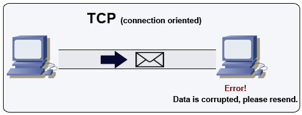

# Sub-topic of The NextGen Architectural Paradigm for designing "Hyper Scale Secured Resilient Product system"

**Application layer Microservices**
```
	* Microservices Overview
		* Service Discovery
		* Service Discovery Health Check
		*  Service Discovery common Tooling
			* Etcd / Consul / Zookeeper
			* Health check
		* Service Communication Protocols
			* Hypertext transfer protocol (HTTP protocol) 
				* Common HTTP verbs
			* Transmission control protocol (TCP protocol)
			* User datagram protocol (UDP protocol)
			* Use TCP over UDP when
			* Use UDP over TCP when
			* Remote procedure call protocol (RPC protocol)
				* Popular RPC frameworks 
					* Protobuf
					* Thrift
					* Avro
				* RPC Protocols elements
					* Client program
					* Client stub procedure
					* Client communication module
					* Server communication module
					*Server stub procedure 
				* Sample RPC calls
				* Disadvantage(s): RPC
			* REST architectural style Protocol (REST Protocol)	
				* Qualities of RESTful interface
				* Sample REST calls
				* Disadvantage(s): REST
			* RPC and REST protocols calls comparison
		* Service Communication Types - Synchronous &  Asynchronism
			* Asynchronism
			* Asynchronism Technique - Message queues Technique
				* Message queues Tooling
					* Redis
					* RabbitMQ
					* KubeMQ
					* Amazon SQS
			* Asynchronism Technique - Task queues Technique
				* Task queues Tooling
					* Celery
			* Asynchronism Technique - RPC / gRPC Technique
			* Asynchronism Technique - Callback Technique
			* Asynchronism Technique - asyncio (async & await) Technique
			* Asynchronism - Back pressure
			* Disadvantage(s): asynchronism
		* Disadvantage(s): application layer Microservice
```


# Application layer Microservices

<p align="center">
  
  <br/>
  <i><a href=http://lethain.com/introduction-to-architecting-systems-for-scale/#platform_layer>Source: Intro to architecting systems for scale</a></i>
</p>

Separating out the web layer from the application layer (also known as platform layer) allows you to scale and configure both layers independently.  Adding a new API results in adding application servers without necessarily adding additional web servers.  The **single responsibility principle** advocates for small and autonomous services that work together.  Small teams with small services can plan more aggressively for rapid growth.

Workers in the application layer also help enable [asynchronism](#asynchronism).

## Microservices Overview

Related to this discussion are [microservices](https://en.wikipedia.org/wiki/Microservices), which can be described as a suite of independently deployable, small, modular services.  Each service runs a unique process and communicates through a well-defined, lightweight mechanism to serve a business goal. <sup><a href=https://smartbear.com/learn/api-design/what-are-microservices>1</a></sup>

Pinterest, for example, could have the following microservices: user profile, follower, feed, search, photo upload, etc.

## Service Discovery

Systems such as [Consul](https://www.consul.io/docs/index.html), [Etcd](https://coreos.com/etcd/docs/latest), and [Zookeeper](http://www.slideshare.net/sauravhaloi/introduction-to-apache-zookeeper) can help services find each other by keeping track of registered names, addresses, and ports.  [Health checks](https://www.consul.io/intro/getting-started/checks.html) help verify service integrity and are often done using an [HTTP](#hypertext-transfer-protocol-http) endpoint.  Both Consul and Etcd have a built in [key-value store](#key-value-store) that can be useful for storing config values and other shared data.


### Service Discovery Health Check
[Health checks](https://www.consul.io/intro/getting-started/checks.html) help verify service integrity and are often done using an [HTTP](#hypertext-transfer-protocol-http) endpoint. 

### Service Discovery common Tooling 
	* [Consul](https://www.consul.io/docs/index.html), 
	* [Etcd](https://coreos.com/etcd/docs/latest), and 
	* [Zookeeper](http://www.slideshare.net/sauravhaloi/introduction-to-apache-zookeeper) 

## Service Communication Protocols

<p align="center">
  
  <br/>
  <i><a href=http://www.escotal.com/osilayer.html>Source: OSI 7 layer model</a></i>
</p>

### Hypertext transfer protocol (HTTP protocol)

HTTP is a method for encoding and transporting data between a client and a server.  It is a request/response protocol: clients issue requests and servers issue responses with relevant content and completion status info about the request.  HTTP is self-contained, allowing requests and responses to flow through many intermediate routers and servers that perform load balancing, caching, encryption, and compression.

HTTP is an application layer protocol relying on lower-level protocols such as **TCP** and **UDP**.

A basic HTTP request consists of a verb (method) and a resource (endpoint).  Below are common HTTP verbs:

##### Common HTTP verbs
| Verb | Description | Idempotent* | Safe | Cacheable |
|---|---|---|---|---|
| GET | Reads a resource | Yes | Yes | Yes |
| POST | Creates a resource or trigger a process that handles data | No | No | Yes if response contains freshness info |
| PUT | Creates or replace a resource | Yes | No | No |
| PATCH | Partially updates a resource | No | No | Yes if response contains freshness info |
| DELETE | Deletes a resource | Yes | No | No |

*Can be called many times without different outcomes.


### Transmission control protocol (TCP protocol)

<p align="center">
  
  <br/>
  <i><a href=http://www.wildbunny.co.uk/blog/2012/10/09/how-to-make-a-multi-player-game-part-1/>Source: How to make a multiplayer game</a></i>
</p>

TCP is a connection-oriented protocol over an [IP network](https://en.wikipedia.org/wiki/Internet_Protocol).  Connection is established and terminated using a [handshake](https://en.wikipedia.org/wiki/Handshaking).  All packets sent are guaranteed to reach the destination in the original order and without corruption through:

* Sequence numbers and [checksum fields](https://en.wikipedia.org/wiki/Transmission_Control_Protocol#Checksum_computation) for each packet
* [Acknowledgement](https://en.wikipedia.org/wiki/Acknowledgement_(data_networks)) packets and automatic retransmission

If the sender does not receive a correct response, it will resend the packets.  If there are multiple timeouts, the connection is dropped.  TCP also implements [flow control](https://en.wikipedia.org/wiki/Flow_control_(data)) and [congestion control](https://en.wikipedia.org/wiki/Network_congestion#Congestion_control).  These guarantees cause delays and generally result in less efficient transmission than UDP.

To ensure high throughput, web servers can keep a large number of TCP connections open, resulting in high memory usage.  It can be expensive to have a large number of open connections between web server threads and say, a [memcached](https://memcached.org/) server.  [Connection pooling](https://en.wikipedia.org/wiki/Connection_pool) can help in addition to switching to UDP where applicable.


### User datagram protocol (UDP protocol)

<p align="center">
  
  <br/>
  <i><a href=http://www.wildbunny.co.uk/blog/2012/10/09/how-to-make-a-multi-player-game-part-1/>Source: How to make a multiplayer game</a></i>
</p>

UDP is connectionless.  Datagrams (analogous to packets) are guaranteed only at the datagram level.  Datagrams might reach their destination out of order or not at all.  UDP does not support congestion control.  Without the guarantees that TCP support, UDP is generally more efficient.

UDP can broadcast, sending datagrams to all devices on the subnet.  This is useful with [DHCP](https://en.wikipedia.org/wiki/Dynamic_Host_Configuration_Protocol) because the client has not yet received an IP address, thus preventing a way for TCP to stream without the IP address.

### Use TCP over UDP when:
* TCP is useful for applications that require high reliability but are less time critical.  Some examples include web servers, database info, SMTP, FTP, and SSH.
* You need all of the data to arrive intact
* You want to automatically make a best estimate use of the network throughput

### Use UDP over TCP when:
* UDP is less reliable but works well in real time use cases such as VoIP, video chat, streaming, and realtime multiplayer games.
* You need the lowest latency
* Late data is worse than loss of data
* You want to implement your own error correction


### Remote procedure call protocol (RPC protocol)

<p align="center">
  
  <br/>
  <i><a href=http://www.puncsky.com/blog/2016-02-13-crack-the-system-design-interview>Source: Crack the system design interview</a></i>
</p>

In an RPC, a client causes a procedure to execute on a different address space, usually a remote server.  The procedure is coded as if it were a local procedure call, abstracting away the details of how to communicate with the server from the client program.  Remote calls are usually slower and less reliable than local calls so it is helpful to distinguish RPC calls from local calls.  

#### Popular RPC frameworks 

* [Protobuf](https://developers.google.com/protocol-buffers/), 
* [Thrift](https://thrift.apache.org/), and 
* [Avro](https://avro.apache.org/docs/current/).

#### RPC Protocols elements
RPC is a request-response protocol:

* **Client program** - Calls the client stub procedure.  The parameters are pushed onto the stack like a local procedure call.
* **Client stub procedure** - Marshals (packs) procedure id and arguments into a request message.
* **Client communication module** - OS sends the message from the client to the server.
* **Server communication module** - OS passes the incoming packets to the server stub procedure.
* **Server stub procedure** -  Unmarshalls the results, calls the server procedure matching the procedure id and passes the given arguments.
* The server response repeats the steps above in reverse order.

#### Sample RPC calls:

```
GET /someoperation?data=anId

POST /anotheroperation
{
  "data":"anId";
  "anotherdata": "another value"
}
```

RPC is focused on exposing behaviors.  RPCs are often used for performance reasons with internal communications, as you can hand-craft native calls to better fit your use cases.

Choose a native library (aka SDK) when:

* You know your target platform.
* You want to control how your "logic" is accessed.
* You want to control how error control happens off your library.
* Performance and end user experience is your primary concern.

HTTP APIs following **REST** tend to be used more often for public APIs.

#### Disadvantage(s): RPC

* RPC clients become tightly coupled to the service implementation.
* A new API must be defined for every new operation or use case.
* It can be difficult to debug RPC.
* You might not be able to leverage existing technologies out of the box.  For example, it might require additional effort to ensure [RPC calls are properly cached](http://etherealbits.com/2012/12/debunking-the-myths-of-rpc-rest/) on caching servers such as [Squid](http://www.squid-cache.org/).

### REST architectural style Protocol (REST Protocol)

REST (Representational state transfer) is an architectural style enforcing a client/server model where the client acts on a set of resources managed by the server.  The server provides a representation of resources and actions that can either manipulate or get a new representation of resources.  All communication must be stateless and cacheable.

#### Qualities of RESTful interface
There are four qualities of a RESTful interface:

* **Identify resources (URI in HTTP)** - use the same URI regardless of any operation.
* **Change with representations (Verbs in HTTP)** - use verbs, headers, and body.
* **Self-descriptive error message (status response in HTTP)** - Use status codes, don't reinvent the wheel.
* **[HATEOAS](http://restcookbook.com/Basics/hateoas/) (HTML interface for HTTP)** - your web service should be fully accessible in a browser.

#### Sample REST calls:

```
GET /someresources/anId

PUT /someresources/anId
{"anotherdata": "another value"}
```

* REST is focused on exposing data.  
* It minimizes the coupling between client/server and is often used for public HTTP APIs.  
* REST uses a more generic and uniform method of exposing resources through URIs, [representation through headers](https://github.com/for-GET/know-your-http-well/blob/master/headers.md), and actions through verbs such as GET, POST, PUT, DELETE, and PATCH. 
* Being stateless, REST is great for horizontal scaling and partitioning.

#### Disadvantage(s): REST

* With REST being focused on exposing data, it might not be a good fit if resources are not naturally organized or accessed in a simple hierarchy.  For example, returning all updated records from the past hour matching a particular set of events is not easily expressed as a path.  With REST, it is likely to be implemented with a combination of URI path, query parameters, and possibly the request body.
* REST typically relies on a few verbs (GET, POST, PUT, DELETE, and PATCH) which sometimes doesn't fit your use case.  For example, moving expired documents to the archive folder might not cleanly fit within these verbs.
* Fetching complicated resources with nested hierarchies requires multiple round trips between the client and server to render single views, e.g. fetching content of a blog entry and the comments on that entry. For mobile applications operating in variable network conditions, these multiple roundtrips are highly undesirable.
* Over time, more fields might be added to an API response and older clients will receive all new data fields, even those that they do not need, as a result, it bloats the payload size and leads to larger latencies.

### RPC and REST calls comparison

| Operation | RPC | REST |
|---|---|---|
| Signup    | **POST** /signup | **POST** /persons |
| Resign    | **POST** /resign<br/>{<br/>"personid": "1234"<br/>} | **DELETE** /persons/1234 |
| Read a person | **GET** /readPerson?personid=1234 | **GET** /persons/1234 |
| Read a person’s items list | **GET** /readUsersItemsList?personid=1234 | **GET** /persons/1234/items |
| Add an item to a person’s items | **POST** /addItemToUsersItemsList<br/>{<br/>"personid": "1234";<br/>"itemid": "456"<br/>} | **POST** /persons/1234/items<br/>{<br/>"itemid": "456"<br/>} |
| Update an item    | **POST** /modifyItem<br/>{<br/>"itemid": "456";<br/>"key": "value"<br/>} | **PUT** /items/456<br/>{<br/>"key": "value"<br/>} |
| Delete an item | **POST** /removeItem<br/>{<br/>"itemid": "456"<br/>} | **DELETE** /items/456 |

<p align="center">
  <i><a href=https://apihandyman.io/do-you-really-know-why-you-prefer-rest-over-rpc/>Source: Do you really know why you prefer REST over RPC</a></i>
</p>

## Service Communication - Synchronous &  Asynchronism

<p align="center">
  
  <br/>
  <i><a href=http://lethain.com/introduction-to-architecting-systems-for-scale/#platform_layer>Source: Intro to architecting systems for scale</a></i>
</p>


### Asynchronism
Asynchronous workflows help reduce request times for expensive operations that would otherwise be performed in-line.  They can also help by doing time-consuming work in advance, such as periodic aggregation of data.


#### Asynchronism Technique- Message queues Technique

Message queues receive, hold, and deliver messages.  If an operation is too slow to perform inline, you can use a message queue with the following workflow:

* An application publishes a job to the queue, then notifies the user of job status
* A worker picks up the job from the queue, processes it, then signals the job is complete

The user is not blocked and the job is processed in the background.  During this time, the client might optionally do a small amount of processing to make it seem like the task has completed.  For example, if posting a tweet, the tweet could be instantly posted to your timeline, but it could take some time before your tweet is actually delivered to all of your followers.

###### Message queues Tooling

**[Redis](https://redis.io/)** is useful as a simple message broker but messages can be lost.

**[RabbitMQ](https://www.rabbitmq.com/)** is popular but requires you to adapt to the 'AMQP' protocol and manage your own nodes.

**[Amazon SQS](https://aws.amazon.com/sqs/)** is hosted but can have high latency and has the possibility of messages being delivered twice.

#### Asynchronism Technique - Task queues Technique

Tasks queues receive tasks and their related data, runs them, then delivers their results.  They can support scheduling and can be used to run computationally-intensive jobs in the background.

###### Task queues Tooling
**Celery** has support for scheduling and primarily has python support.


#### Asynchronism Technique - Callback Technique

#### Asynchronism Technique - asyncio (async & await) Technique

### Asynchronism - Back pressure 

If queues start to grow significantly, the queue size can become larger than memory, resulting in cache misses, disk reads, and even slower performance.  [Back pressure](http://mechanical-sympathy.blogspot.com/2012/05/apply-back-pressure-when-overloaded.html) can help by limiting the queue size, thereby maintaining a high throughput rate and good response times for jobs already in the queue.  Once the queue fills up, clients get a server busy or HTTP 503 status code to try again later.  Clients can retry the request at a later time, perhaps with [exponential backoff](https://en.wikipedia.org/wiki/Exponential_backoff).

### Disadvantage(s): asynchronism

* Use cases such as inexpensive calculations and realtime workflows might be better suited for synchronous operations, as introducing queues can add delays and complexity.


## Disadvantage(s): application layer Microservice

* Adding an application layer with loosely coupled services requires a different approach from an architectural, operations, and process viewpoint (vs a monolithic system).
* Microservices can add complexity in terms of deployments and operations.


## Source(s) and further reading
* [Intro to architecting systems for scale](http://lethain.com/introduction-to-architecting-systems-for-scale)
* [Crack the system design interview](http://www.puncsky.com/blog/2016-02-13-crack-the-system-design-interview)
* [Service oriented architecture](https://en.wikipedia.org/wiki/Service-oriented_architecture)
* [Introduction to Zookeeper](http://www.slideshare.net/sauravhaloi/introduction-to-apache-zookeeper)
* [Here's what you need to know about building microservices](https://cloudncode.wordpress.com/2016/07/22/msa-getting-started/)
* [It's all a numbers game](https://www.youtube.com/watch?v=1KRYH75wgy4)
* [Applying back pressure when overloaded](http://mechanical-sympathy.blogspot.com/2012/05/apply-back-pressure-when-overloaded.html)
* [Little's law](https://en.wikipedia.org/wiki/Little%27s_law)
* [What is the difference between a message queue and a task queue?](https://www.quora.com/What-is-the-difference-between-a-message-queue-and-a-task-queue-Why-would-a-task-queue-require-a-message-broker-like-RabbitMQ-Redis-Celery-or-IronMQ-to-function)
* [What is HTTP?](https://www.nginx.com/resources/glossary/http/)
* [Difference between HTTP and TCP](https://www.quora.com/What-is-the-difference-between-HTTP-protocol-and-TCP-protocol)
* [Difference between PUT and PATCH](https://laracasts.com/discuss/channels/general-discussion/whats-the-differences-between-put-and-patch?page=1)
* [Networking for game programming](http://gafferongames.com/networking-for-game-programmers/udp-vs-tcp/)
* [Key differences between TCP and UDP protocols](http://www.cyberciti.biz/faq/key-differences-between-tcp-and-udp-protocols/)
* [Difference between TCP and UDP](http://stackoverflow.com/questions/5970383/difference-between-tcp-and-udp)
* [Transmission control protocol](https://en.wikipedia.org/wiki/Transmission_Control_Protocol)
* [User datagram protocol](https://en.wikipedia.org/wiki/User_Datagram_Protocol)
* [Scaling memcache at Facebook](http://www.cs.bu.edu/~jappavoo/jappavoo.github.com/451/papers/memcache-fb.pdf)

* [Do you really know why you prefer REST over RPC](https://apihandyman.io/do-you-really-know-why-you-prefer-rest-over-rpc/)
* [When are RPC-ish approaches more appropriate than REST?](http://programmers.stackexchange.com/a/181186)
* [REST vs JSON-RPC](http://stackoverflow.com/questions/15056878/rest-vs-json-rpc)
* [Debunking the myths of RPC and REST](http://etherealbits.com/2012/12/debunking-the-myths-of-rpc-rest/)
* [What are the drawbacks of using REST](https://www.quora.com/What-are-the-drawbacks-of-using-RESTful-APIs)
* [Crack the system design interview](http://www.puncsky.com/blog/2016-02-13-crack-the-system-design-interview)
* [Thrift](https://code.facebook.com/posts/1468950976659943/)
* [Why REST for internal use and not RPC](http://arstechnica.com/civis/viewtopic.php?t=1190508)


## Contact info

Feel free to contact me to discuss any issues, questions, or comments.

My contact info can be found on my [GitHub page](https://github.com/DeepHiveMind).

## License

I, *The DeepHiveMind*, am providing code and resources in this repository to you under custom Copyright & license (Copyright 2020 DeepHiveMind & Creative Commons Legal Code CC0 1.0 Universal). Please Refer to the [Copyright 2020 DeepHiveMind License](https://github.com/DeepHiveMind/HyperScale_Distributed_Smart_Secured_Enterprise-Grade-Product-Design/blob/main/LICENSE) for further details as to this. Thanks!
